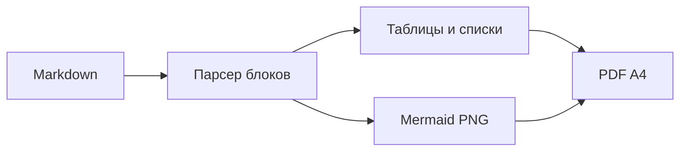
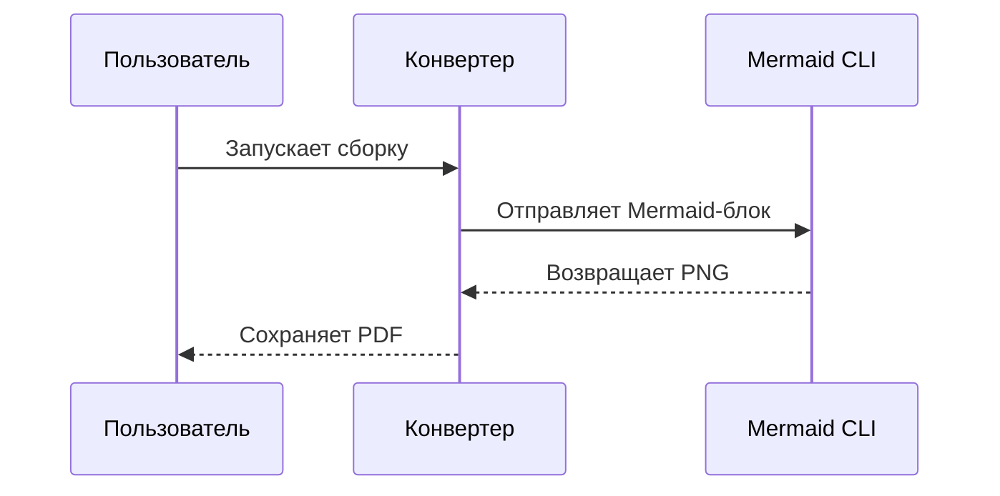
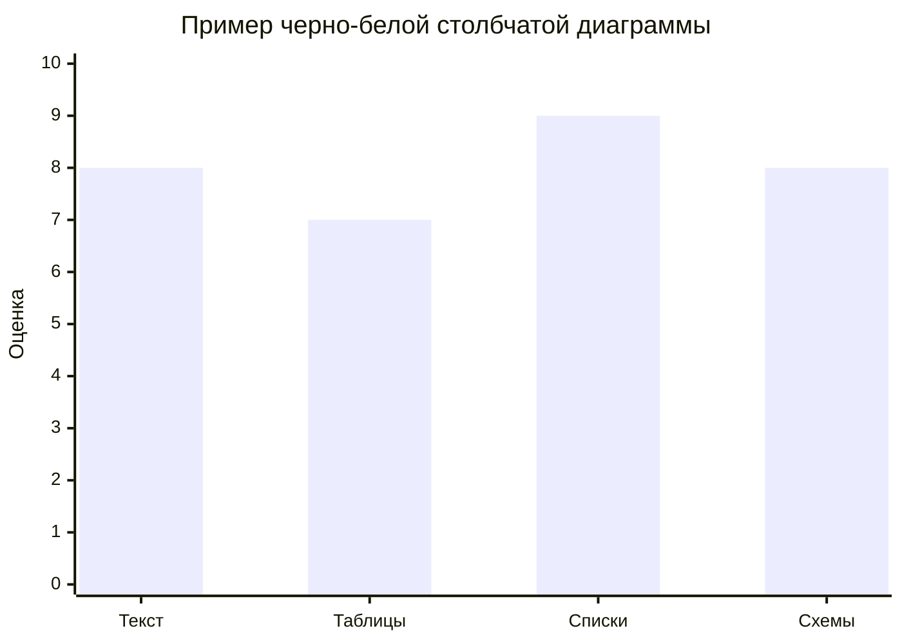

# md2pdf

`md2pdf` — утилита для сборки Markdown-документов в PDF A4 portrait с оформлением, близким к требованиям ГОСТ Р 7.32: Times New Roman, кегль 14, межстрочный интервал 1,5, абзацный отступ 1,25 см, простые таблицы и нижняя нумерация страниц.

## 1. Возможности

| Возможность | Как работает | Примечание |
| --- | --- | --- |
| Основной текст | Times New Roman, 14 pt, выравнивание по ширине | Абзацный отступ 1,25 см |
| Заголовки | Times New Roman Bold, 14 pt | Первый заголовок центрируется |
| Списки | Маркер `–`, отступ 1,25 см слева | Между маркером и текстом ставится пробел |
| Таблицы | Простая сетка, без декоративных цветов | Минимальный кегль 11 pt |
| Mermaid | Рендерит диаграммы в PNG и вставляет в PDF | Для `sequenceDiagram` и `xychart` используется упрощенный черно-белый рендер |
| Страницы | A4, portrait, поля 30/10/20/20 мм | Номер страницы снизу по центру |

## 2. Установка

Требуется Python 3.11+ и Node.js. Mermaid CLI ставится как npm-зависимость проекта.

```bash
npm install
python3 -m venv .venv
. .venv/bin/activate
pip install -r requirements.txt
```

## 3. Использование

Сборка README в PDF:

```bash
python3 src/md2pdf.py README.md README.pdf
```

Сборка другого документа:

```bash
python3 src/md2pdf.py examples/example.md examples/example.pdf
```

## 4. Пример Mermaid



## 5. Пример последовательности



## 6. Пример диаграммы шкал



## 7. Ограничения

Проект не является полноценным Markdown-движком. Он покрывает практичные блоки, которые чаще всего нужны для учебной, проектной и ВКР-документации: заголовки, абзацы, списки, таблицы, блоки кода и Mermaid.

Если документ использует сложный HTML внутри Markdown, вложенные списки, footnotes или нестандартные расширения Markdown, их лучше предварительно упростить.

## 8. Структура проекта

| Путь | Назначение |
| --- | --- |
| `src/md2pdf.py` | Основной CLI-скрипт |
| `README.md` | Документация и одновременно пример входного файла |
| `README.pdf` | PDF, собранный из README |
| `examples/example.md` | Отдельный пример Markdown-документа |
| `prompts/polish-script.md` | Промпт для следующего этапа улучшения проекта |

