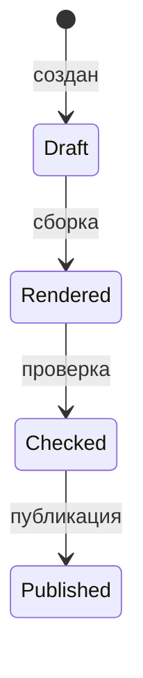

# Пример документа

Этот файл показывает минимальный набор блоков, которые можно собрать в PDF: абзацы, таблицу, список и Mermaid-диаграмму.

## 1. Таблица

| Раздел | Состояние | Комментарий |
| --- | --- | --- |
| Текст | Готов | Используется выравнивание по ширине |
| Таблицы | Готово | Оформление простое, без декоративных цветов |
| Диаграммы | Готово | Mermaid рендерится перед вставкой в PDF |

## 2. Список

- Первый пункт списка.
- Второй пункт списка с длинным текстом, чтобы проверить переносы и сохранение отступа.
- Третий пункт списка.

## 3. Диаграмма

